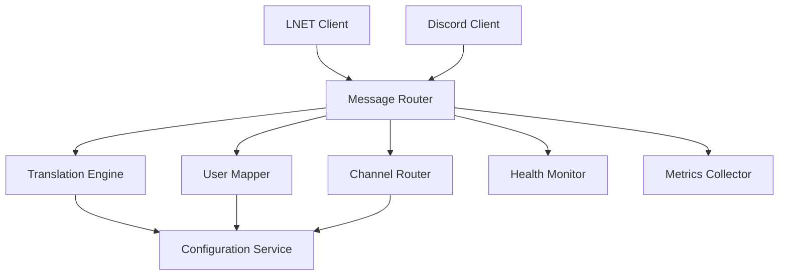

# Bridge Service

*Coming Soon*

Central orchestration service that connects LNET and Discord systems, providing message translation, user mapping, and comprehensive monitoring.

## Overview

The Bridge Service acts as the intelligent middleware between LNET game servers and Discord, handling protocol translation, user authentication, and system coordination.

## Planned Architecture



## Core Features

### 🔄 Message Processing
- **Protocol Translation** - LNET ↔ Discord message conversion
- **Content Filtering** - Spam detection and content moderation
- **Message Routing** - Intelligent channel and user mapping
- **Format Transformation** - Rich embed generation from game text

### 👥 User Management
- **Identity Mapping** - Link game characters to Discord users
- **Authentication** - Secure user verification
- **Permission System** - Role-based access control
- **Session Management** - User state tracking

### 📊 System Monitoring
- **Health Checks** - Component status monitoring
- **Performance Metrics** - Throughput and latency tracking
- **Error Handling** - Graceful degradation and recovery
- **Logging** - Comprehensive audit trails

### ⚙️ Configuration
- **Dynamic Settings** - Runtime configuration updates
- **Channel Mapping** - Flexible routing rules
- **Feature Toggles** - A/B testing and gradual rollouts
- **Security Policies** - Access control and rate limiting

## Documentation Structure

<div class="code-example" markdown="1">

**Architecture Guide** *(Coming Soon)*  
System design and component interaction

</div>

<div class="code-example" markdown="1">

**Configuration** *(Coming Soon)*  
Setup and customization options

</div>

<div class="code-example" markdown="1">

**API Reference** *(Coming Soon)*  
Service interfaces and methods

</div>

<div class="code-example" markdown="1">

**Operations Guide** *(Coming Soon)*  
Deployment, monitoring, and maintenance

</div>

## Service Design Preview

```csharp
// Future service architecture preview
public class BridgeService : BackgroundService
{
    private readonly ILNetClient _lnetClient;
    private readonly IDiscordClient _discordClient;
    private readonly IMessageTranslator _translator;
    private readonly IUserMapper _userMapper;

    protected override async Task ExecuteAsync(CancellationToken stoppingToken)
    {
        await Task.WhenAll(
            ProcessLNetMessages(stoppingToken),
            ProcessDiscordMessages(stoppingToken),
            MonitorHealth(stoppingToken)
        );
    }

    private async Task ProcessLNetMessages(CancellationToken cancellationToken)
    {
        await foreach (var message in _lnetClient.GetMessageStreamAsync(cancellationToken))
        {
            var discordMessage = await _translator.TranslateToDiscord(message);
            await _discordClient.SendAsync(discordMessage);
        }
    }
}
```

## Integration Points

### With LNet Library
- **Message Consumption** - Real-time LNET message processing
- **Connection Management** - Health monitoring and reconnection
- **Error Handling** - Graceful degradation strategies

### With Discord Library
- **Bot Commands** - Slash command registration and handling
- **Event Processing** - Discord event to LNET message translation
- **Rich Content** - Embed and attachment management

## Deployment Considerations

### Container Strategy
- **Multi-service Architecture** - Separate containers for each component
- **Health Check Integration** - Kubernetes readiness and liveness probes
- **Resource Management** - CPU and memory optimization
- **Scaling Patterns** - Horizontal scaling considerations

### Configuration Management
- **Environment Variables** - Container-friendly configuration
- **Secret Management** - Secure credential handling
- **Feature Flags** - Runtime behavior modification
- **Hot Reload** - Configuration updates without restarts

---

*This component is part of the LNET-Discord Bridge educational project. Documentation will be added as development progresses.*