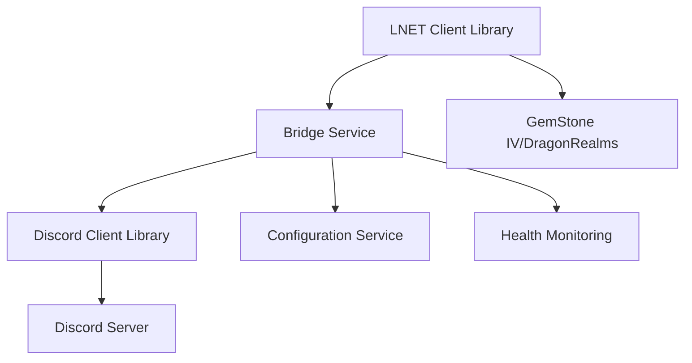

# LNET-Discord Bridge Documentation

Welcome to the comprehensive documentation for the LNET-Discord Bridge application - an AI-assisted translation and modernization project demonstrating best practices in .NET 9 development.

## 🎯 Project Overview

This application bridges LNET (LichNet) game servers with Discord, enabling real-time communication between in-game players and Discord users. Built as an educational exploration of AI-assisted software development, this project demonstrates modern .NET patterns, high-performance networking, and production-ready architecture.

## 📚 Documentation Sections

### Core Libraries

<div class="code-example" markdown="1">

[**LNet Library**](){: .btn .btn-primary .fs-5 .mb-4 .mb-md-0 .mr-2 }

High-performance .NET 9 client library for LNET protocol communication with span-based XML parsing, production-grade resilience, and comprehensive logging.

</div>

<div class="code-example" markdown="1">

[**Discord Library**](){: .btn .btn-outline .fs-5 .mb-4 .mb-md-0 .mr-2 }

Modern Discord bot client with slash commands, embed messaging, role-based permissions, and rate limiting. *(Coming Soon)*

</div>

### Application Services

<div class="code-example" markdown="1">

[**Bridge Service**](){: .btn .btn-outline .fs-5 .mb-4 .mb-md-0 .mr-2 }

Central orchestration service connecting LNET and Discord systems with message translation, user mapping, and health monitoring. *(Coming Soon)*

</div>

<div class="code-example" markdown="1">

[**Deployment Guide**](){: .btn .btn-outline .fs-5 .mb-4 .mb-md-0 .mr-2 }

Container deployment, Kubernetes orchestration, and production configuration guidance. *(Coming Soon)*

</div>

## 🚀 Quick Start

### Prerequisites

- .NET 9.0 SDK or later
- Docker (for containerized deployment)
- LNET server access (GemStone IV or DragonRealms account)
- Discord Bot Token and server permissions

### Installation

```bash
# Clone the repository
git clone <repository-url>
cd lnet-discord-bridge

# Restore dependencies
dotnet restore

# Build the solution
dotnet build
```

### Basic Usage

```csharp
using LNet;

// Configure LNET client
var options = new Options
{
    Host = "lnet.lichproject.org",
    User = "YourUsername",
    Game = "GSIV",
    EnableKeepalive = true
};

// Connect and process messages
using var client = await Client.CreateAsync(options);
await foreach (var message in client.GetMessageStreamAsync())
{
    Console.WriteLine($"Received: {message}");
}
```

## 🏗️ Architecture



## 🎓 Educational Focus

This project serves as a comprehensive learning experience exploring:

- **AI-Assisted Development**: Best practices for leveraging LLMs in software engineering
- **Cross-Language Translation**: Converting GoLang applications to modern C#
- **Performance Engineering**: Span-based parsing and zero-allocation techniques
- **Production Architecture**: Resilient, scalable system design patterns

## ⚠️ Important Notice

**This software is provided for educational and research purposes only.** The authors assume no liability for any damages or issues arising from its use. This is an experimental project demonstrating AI-assisted development techniques.

## 📖 Getting Started

For detailed information about each component:

1. **Start with the [LNet Library documentation]()** to understand the core networking component
2. **Review the [API Reference]()** for comprehensive class and method documentation  
3. **Check out [Examples]()** for practical usage patterns
4. **Explore [Performance]()** characteristics and optimization techniques

## 🤝 Contributing

This educational project welcomes contributions that further the learning objectives. Please see our [Contributing Guidelines](https://github.com/your-repo/contributing) for more information.

---

*Documentation built with [Just the Docs](https://just-the-docs.github.io/just-the-docs/) theme for Jekyll*