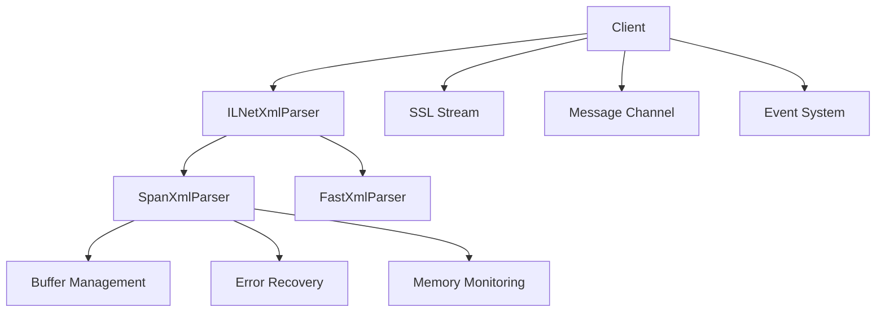

# LNet Library

High-performance .NET 9 client library for LNET (LichNet) protocol communication with production-grade resilience and zero-allocation parsing.

## Overview

The LNet library provides a robust, high-performance client for connecting to LNET servers used by games like GemStone IV and DragonRealms. Built with modern .NET 9 features, it emphasizes performance, reliability, and ease of use.

## Key Features

### 🚀 Performance
- **Span-based XML parsing** with zero allocations
- **Channel-based message processing** using .NET 9 optimizations
- **ArrayPool buffer management** for memory efficiency
- **Sub-millisecond message parsing** latency

### 🛡️ Resilience
- **Buffer boundary protection** for network fragmentation
- **Malformed XML recovery** with circuit breaker patterns
- **Timeout protection** on all stream operations
- **Memory pressure handling** with adaptive algorithms

### 🔧 Features
- **SSL/TLS support** with certificate validation
- **Automatic keepalive** management
- **Event-driven architecture** with comprehensive events
- **Structured logging** with ZLogger integration

## Quick Start

```csharp
using LNet;

// Configure connection
var options = new Options
{
    Host = "lnet.lichproject.org",
    User = "YourCharacter",
    Game = "GSIV", // or "DR" for DragonRealms
    EnableKeepalive = true,
    Debug = true
};

// Connect and process messages
using var client = await Client.CreateAsync(options);

// Set up event handlers
client.OnConnected += async () => 
{
    Console.WriteLine("Connected to LNET!");
    await client.JoinChannelAsync("ooc");
};

client.OnMessageReceived += async (message) =>
{
    Console.WriteLine($"Received: {message}");
};

// Process messages continuously
await foreach (var message in client.GetMessageStreamAsync())
{
    switch (message)
    {
        case Message msg when msg.Type == "private":
            Console.WriteLine($"Private message from {msg.From}: {msg.Text}");
            break;
        case LocationRequest req:
            Console.WriteLine($"Location request from {req.User}");
            break;
    }
}
```

## Architecture

The LNet library is built with a modular, high-performance architecture:



### Core Components

- **Client**: Main interface with connection management and keepalive
- **SpanXmlParser**: High-performance span-based XML parser (default)
- **FastXmlParser**: XmlReader-based fallback parser
- **Message Types**: Strongly-typed message structures
- **Options**: Comprehensive configuration system

## Performance Characteristics

| Metric | Value |
|--------|-------|
| **Message Processing** | ~1000 messages/second |
| **Parse Latency** | <1ms average |
| **Memory Allocation** | Zero-allocation parsing |
| **Buffer Sizes** | 16KB-1MB adaptive |
| **Connection Timeout** | 30 seconds default |

## Documentation Sections

<div class="code-example" markdown="1">

[**Getting Started**](){: .btn .btn-blue }
Complete setup and first connection guide

</div>

<div class="code-example" markdown="1">

[**API Reference**](){: .btn .btn-blue }
Comprehensive class and method documentation

</div>

<div class="code-example" markdown="1">

[**Performance**](){: .btn .btn-blue }
Optimization techniques and benchmarks

</div>

<div class="code-example" markdown="1">

[**Configuration**](){: .btn .btn-blue }
Detailed configuration options and examples

</div>

<div class="code-example" markdown="1">

[**Advanced Topics**](){: .btn .btn-blue }
Parser internals, custom logging, and DI integration

</div>

## Package Information

```xml
<PackageReference Include="LNet" Version="2.0.0" />
```

**Dependencies:**
- Microsoft.Extensions.Logging.Abstractions (9.0.0)
- ZLogger (2.5.10)

**Target Framework:** .NET 9.0

## Support

For issues, questions, or contributions related to the LNet library:

- [GitHub Issues](https://github.com/yourusername/lnet-discord-bridge/issues)
- [API Documentation]()
- [Examples Repository](https://github.com/yourusername/lnet-discord-bridge/tree/main/examples)

---

*Part of the LNET-Discord Bridge educational project exploring AI-assisted software development.*